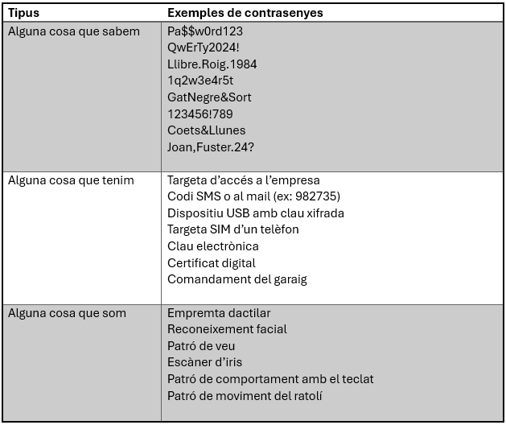

# CONTRASENYES
Hui dia, les contrasenyes o claus de seguretat són l’equivalent modern dels forrellats i les muralles. Són allò que separa la nostra privacitat digital de l’exterior, i si es veuen compromeses podem caure en una autèntica cascada de problemes que, en el pitjor dels casos, ens poden arruïnar la vida. L'objectiu d'aquest post no és altre que donar a coneixer els principals conceptes relacionats amb les contrasenyes i com aconseguir tindre contrasenyes a prova de qualsevol atac i fàcils de recordar.

## QUINS TIPUS DE CONTRASENYA HI HA?
Podem classificar les contrasenyes de moltes maneres, però una de les classificacions més interessants és en funció del seu origen. Poden ser:

### Alguna cosa que sabem: 
Les contrasenyes més comunes, el que ens ve al cap quan pensem en la paraula “contrasenya”. Són cadenes de caràcters (majúscules, minúscules, números o símbols especials) que hem après de memòria. El problema és que, si hem de recordar moltes, tendim a simplificar-les, a repetir-les i, per tant, a fer-les dèbils. Són l’origen del 90% de problemes de seguretat: persones que utilitzen “123456”, “password” o el nom de la seua mascota. És per això que recomanem sempre crear contrasenyes robustes, úniques i difícils d’endevinar, i utilitzar un gestor de contrasenyes per no haver d’emprar la mateixa a tot arreu. Més avall vorem què és aixo del gestor de contrasenyes i com crear contrasenyes fortes.

### Alguna cosa que tenim:
Són contrasenyes associades a un objecte físic o a un canal digital que podem posseir.  Aquests tipus de claus s’assemblen molt a les claus físiques d’una porta. Són molt pràctiques. El problema és que les podem perdre de seguida i ens les poden furtar o duplicar amb facilitat. A més, canviar-les pot ser costós i lent. Per això, s’acostumen a combinar amb altres factors per augmentar la seguretat (MFA).

### Alguna cosa que som: 
Contrasenyes basades en dades biomètriques. Són segures i còmodes, però tenen inconvenients. Si es comprometen són difícils o impossibles de canviar ja que formen part de la nostra pròpia identitat (empremta, iris, veu...). També poden ser més fàcils de furtar del que pensem mitjançant tècniques de clonació, IA i altres. A més, existeix el risc que la informació biomètrica es faça servir per a finalitats no previstes en el futur, especialment si bases de dades d’aquest tipus es veuen compromeses o, com fa uns pocs anys, algunes empreses es dediquen a obtindre les teues [dades biometriques per uns bitcoins](https://www.rtve.es/noticias/20240225/asi-es-worldcoin-escaneo-iris-criptomonedas-negocio-chatgpt/15982136.shtml). 

## QUÈ VOL DIR MFA?
MFA són les sigles de “Multi-Factor Authentication” (Autenticació Multifactor). Significa combinar almenys dos dels tipus de contrasenyes anteriors per accedir a un compte. En fer-ho, la seguretat es multiplica: si una de les “claus” es veu compromesa, l’altra segueix protegint-nos. Un exemple d’MFA pot ser accedir al gimnàs amb una targeta i una empremta dactilar, o fer un moviment bancari introduint la contrasenya i confirmant-ho amb un codi rebut al mòbil. Aquesta pràctica és molt recomanable i, sempre que puguem, l’hauríem d’activar.

## COM ES GUARDEN LES CONTRASENYES?
Les bones pràctiques d’emmagatzematge de contrasenyes als servidors estableixen que mai s’han de guardar en text pla. En lloc d’això, es passen per una funció [hash](https://openaccess.uoc.edu/bitstream/10609/142628/9/Criptografia_M%C3%B2dul%204_Funcions%20hash.pdf), un algorisme que converteix la contrasenya en una cadena de caràcters sense sentit. Això fa impracticable recuperar la contrasenya original a partir d’aquesta cadena. Quan introduïm la nostra clau per accedir, el servidor en fa el hash i el compara amb el que té guardat; si coincideixen, ens dóna accés. D’aquesta manera, tot i que algú accedisca a la base de dades, només obtindrà hashes sense utilitat pràctica.

Com a usuaris, el millor lloc per guardar les nostres credencials és un gestor de contrasenyes. Una altra opció podria ser una llibreta física ben amagada i actualitzada, però això és menys pràctic i més insegur. Més opcions desaconsellades serien posar-les en notes al mòbil, xats privats, correus electrònics o, fins i tot, confiar únicament en la nostra memòria.

## QUÈ SÓN ELS GESTORS DE CONTRASENYES?
Els gestors de contrasenyes són eines dissenyades per emmagatzemar, organitzar i protegir de manera segura totes les contrasenyes que usem en el nostre dia a dia. Són com una caixa forta digital: només cal recordar una contrasenya mestra (que, per descomptat, ha de ser molt forta).

Funcionen emmagatzemant les credencials en una base de dades xifrada. La majoria, a més, poden generar contrasenyes fortes i úniques per a cada compte, eliminar la necessitat de memoritzar-les, sincronitzar dades entre dispositius i omplir automàticament els camps de nom d’usuari i contrasenya en els navegadors.

Riscos: si oblidem o ens roben la contrasenya mestra, perdem l’accés a totes les credencials. A més, si el servei del gestor pateix vulnerabilitats, els nostres secrets podrien quedar exposats.

Algunes opcions populars:

- LastPass: Multiplataforma, genera contrasenyes, autocompleció, emmagatzematge xifrat. Gratuït en funcionalitats bàsiques.
- 1Password: Multiplataforma, interfície fàcil, MFA, generació de contrasenyes i altres funcionalitats. De pagament.
- Bitwarden: Multiplataforma, codi obert, alt nivell de seguretat, generació de contrasenyes, autocompleció. Versió gratuïta completa i opcions premium a bon preu.

Personalment recomane Bitwarden, no és gens difícil de utilitzar, pràctic i totalment gratuit; és el que jo utilitze fins ara. 

## BONES PRÀCTIQUES PER CREAR CONTRASENYES

### El tamany importa:
Fer servir contrasenyes llargues i complexes és molt important per aconseguir una contrasenya forta. Barrejar majúscules, minúscules, números i caràcters especials. Com més llarga i variada siga la contrasenya, millor. Si algú intenta esbrinar la nostra ccontrasenya, s'enfrontarà a la següent fórmula:

Nombre de possibles combinacions = (Tamany del conjunt de caràcters) ^ Tamany de la contrasenya.

Per un pin de quatre dígits (10 possibles caràcters, del 0 al 9): 10 ^ 4 = 10000 possibles combinacions
Per una contrasenya amb sols lletres minúscules (26 lletres) i de 6 caràcters (qwerty): 26 ^6 = 308.915.776 possibles combinacions
Una contrasenya de majúscules, minúscules, dígits i caràcters specials (94 possibles caràcters) de 10 caràcters : 94 ^10 = 53.861.511.400.000.000.000, més de 53 trillons de combinacions.

Si ens fixem en la fórmula plantejada, és molt important emprar tots els caràcters disponibles (A-Z, a-z, 0-9, #@~€¬&?¿+*^[]{}-;:etc...), però és inclús encara més important la seua longitud. Per tant, si, el tamany importa moltissim a l'hora de crear les nostres contrasenyes. Però no vos preocupeu, més endavant vorem tècniques per crear contrasenyes llargues, complexes i fàcils de recordar. 

### No et cases amb les contrassenyes:

La fidelitat és un tret socialment molt preciat, però gens segur. És molt comú no canviar mai la nostra contrassenya i mantindre-la com si es tractara de l'amor de la nostra vida. Aquesta pràctica, combinada amb la reutilització de contrasenyes que més endavant parlarem, fica en perill els nostres comptes personals. En el cas estricte de no canviar-les mai, si algú aconsegueix tindre accés a la nostra contrasenya, la troba anotada en algún lloc o la recorda després de molt temps que la varem deixa, correm el perill que puga accedir als nostres comptes de per vida. Convé canviar les contrasenyes cada pocs mesos, dos vegades a l'any com a poc! D'aquesta forma, la teua exparella no podrà accedir al teu compte de netflix! 

### No repetisques la mateixa contrasenya:

De la mateixa manera que no és recomanable tindre una mateixa clau pel garaig, el cotxe, la llar, el treball i la casa dels teus pares; no és gens segur emprar la mateixa contrasenya per a diferents comptes. És comú que per evitar necessitar recordar docenes de contrasenyes repetim una mateixa per diferents comptes. Qui estiga lliure d'aquest pecat, que polse el botó nuclear. Però si alguna d'aquestes contrasenyes és descoberta, és molt senzill per qualsevol atacant provar a utilitzar-la en altres aplicacions i comptes per tal d'accedir a la nostra informació. Penseu per un moment en la de plataformes que compten amb les vostres dades bancàries: Amazon, Deliveroo, Uber, JustEat, Airbnb, Groupon... Esteu segurs que aquestos comptes no tenen la mateixa contrasenya que li vareu ficar a un joc absurde al qual us vareu tindre que subscriure per jugar? No preferirieu canviar-la? 

### Utilitza els gestors de contrassenyes:
Tots aquestos problemes que hem descrit són fàcilment resolts emprant un gestor de contrasenyes. Aquest pot fàcilment crear i recordar contrasenyes complexes, llargues i úniques per a cada compte. A més, podem emprar aquest gestor de contrasenyes en qualsevol dispositiu. 

### Activar MFA
Sempre que siga possible és recomanable emprar la Autenticació Multifactor. D'aquesta manera si alguna contrasenya està compromesa, qualsevol atacant tindrà que redoblar esforços per obtindre l'altra part de la autenticació. És com si per atracar-nos, algú tinguera que amedrentar a la vegada a dos persones que es troben en dos ciutats diferents.

## TALLER DE CONTRASENYES:

Abans de començar amb aquest xicotet taller d'exemples, ens queda un últim concepte molt important. Normalment quan pensem en contrasenyes pensem en una mena de "paraula", un xurro de caràcters. Hui dia és sabut que és més aconsellable canviar aquesta noció per la de "PASSPHRASE" (frase de seguretat). La idea és augmentar la seguretat i complexitat de les contrasenyes pensant en un conjunt de xurros. En aquest sentit i recordant els consells de tamany i varietat de caràcters us presente les següents idees per crear les vostres contrasenyes: 

- Procedència de les vostres exparelles ordenat alfabèticament, separades per un caràcter especial, l'any en que us vareu coneixer i per acabar altre caràcter diferent: Santander17;Tenerife13;Terol16;Zamora22$
- El model i color dels cotxes amb els quals vares creixer en la teua llar separats per un caràcter especial, la matrícula del teu cotxe actual i per acabar altre caràcter especial diferent: FiestaBlanc-FiatPlatejat-i30Roig-4553HFN)
- El teu plat favorit, dos caràcters especials seguits, un aliment que odies, els mateixos dos caràcters especials i el teu any de naixement menys 11: ArrosAlForn:-Lentilles:-74
- Paraules mal escrites comunes en la teua familia separades per un caràcter especial, l'any d'alguna pèrdua significativa i un últim caràcter especial: Calandario+Gomitar+Jeripolla2021?

Com podeu comprovar, no té per qué ser difícil crear contrasenyes complexes, llargues i fàcils de memoritzar. El millor consell que us puc donar és que creeu varies d'aquestes possibles contrasenyes i la que més vos agrade, siga ben forta i us siga agradable de recordar: EMPREU-LA PER CREAR EL VOSTRE COMPTE EN EL GESTOR DE CONTRASENYES! Aquesta serà la clau que obriga i guarde tots els panys!

Comproveu com de fortes són les vostres contrasenyes en les següents pàgines web:
[Kaspersky Password Checker](https://password.kaspersky.com/es/)
[BitWarden Password Tester](https://bitwarden.com/password-strength/)
[The Password Meter](https://passwordmeter.com/)
