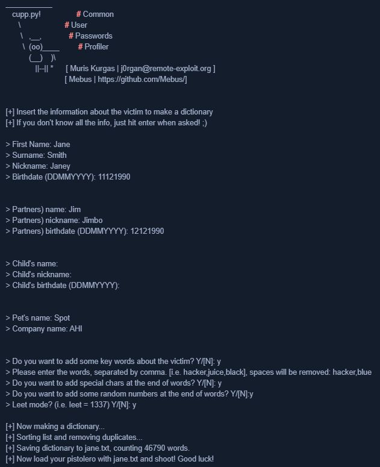

# CONTRASENYES
Hui dia, les contrasenyes o claus de seguretat són l’equivalent modern dels forrellats i les muralles. Són allò que separa la nostra privacitat digital de l’exterior, i si es veuen compromeses podem caure en una autèntica cascada de problemes que, en el pitjor dels casos, ens poden arruïnar la vida.

## QUINS TIPUS DE CONTRASENYA HI HA?
Podem classificar les contrasenyes de moltes maneres, però una de les classificacions més interessants és en funció del seu origen. Poden ser:

### Alguna cosa que sabem: 
Les contrasenyes més comunes, el que ens ve al cap quan pensem en la paraula “contrasenya”. Són cadenes de caràcters (majúscules, minúscules, números o símbols especials) que hem après de memòria. El problema és que, si hem de recordar moltes, tendim a simplificar-les, a repetir-les i, per tant, a fer-les dèbils. Són l’origen del 90% de problemes de seguretat: persones que utilitzen “123456”, “password” o el nom de la seua mascota. És per això que recomanem sempre crear contrasenyes robustes, úniques i difícils d’endevinar, i utilitzar un gestor de contrasenyes per no haver d’emprar la mateixa a tot arreu. Més avall vorem què és aixo del gestor de contrasenyes i com crear contrasenyes fortes.

### Alguna cosa que tenim:
Són contrasenyes associades a un objecte físic o a un canal digital que podem posseir.  Aquests tipus de claus s’assemblen molt a les claus físiques d’una porta. Són molt pràctiques. El problema és que les podem perdre de seguida i ens les poden furtar o duplicar amb facilitat. A més, canviar-les pot ser costós i lent. Per això, s’acostumen a combinar amb altres factors per augmentar la seguretat (MFA).

### Alguna cosa que som: 
Contrasenyes basades en dades biomètriques. Són segures i còmodes, però tenen inconvenients. Si es comprometen són difícils o impossibles de canviar ja que formen part de la nostra pròpia identitat (empremta, iris, veu...). També poden ser més fàcils de furtar del que pensem mitjançant tècniques de clonació, IA i altres. A més, existeix el risc que la informació biomètrica es faça servir per a finalitats no previstes en el futur, especialment si bases de dades d’aquest tipus es veuen compromeses o, com fa uns pocs anys, algunes empreses es dediquen a obtindre les teues [dades biometriques per uns bitcoins](https://www.rtve.es/noticias/20240225/asi-es-worldcoin-escaneo-iris-criptomonedas-negocio-chatgpt/15982136.shtml). 

## QUÈ VOL DIR MFA?
MFA són les sigles de “Multi-Factor Authentication” (Autenticació Multifactor). Significa combinar almenys dos dels tipus de contrasenyes anteriors per accedir a un compte. En fer-ho, la seguretat es multiplica: si una de les “claus” es veu compromesa, l’altra segueix protegint-nos. Un exemple d’MFA pot ser accedir al gimnàs amb una targeta i una empremta dactilar, o fer un moviment bancari introduint la contrasenya i confirmant-ho amb un codi rebut al mòbil. Aquesta pràctica és molt recomanable i, sempre que puguem, l’hauríem d’activar.

## COM ES GUARDEN LES CONTRASENYES?
Les bones pràctiques d’emmagatzematge de contrasenyes als servidors estableixen que mai s’han de guardar en text pla. En lloc d’això, es passen per una funció [hash](https://openaccess.uoc.edu/bitstream/10609/142628/9/Criptografia_M%C3%B2dul%204_Funcions%20hash.pdf), un algorisme que converteix la contrasenya en una cadena de caràcters sense sentit. Això fa impracticable recuperar la contrasenya original a partir d’aquesta cadena. Quan introduïm la nostra clau per accedir, el servidor en fa el hash i el compara amb el que té guardat; si coincideixen, ens dóna accés. D’aquesta manera, tot i que algú accedisca a la base de dades, només obtindrà hashes sense utilitat pràctica.

Com a usuaris, el millor lloc per guardar les nostres credencials és un gestor de contrasenyes. Una altra opció podria ser una llibreta física ben amagada i actualitzada, però això és menys pràctic i més insegur. Més opcions desaconsellades serien posar-les en notes al mòbil, xats privats, correus electrònics o, fins i tot, confiar únicament en la nostra memòria.

## QUÈ SÓN ELS GESTORS DE CONTRASENYES?
Els gestors de contrasenyes són eines dissenyades per emmagatzemar, organitzar i protegir de manera segura totes les contrasenyes que usem en el nostre dia a dia. Són com una caixa forta digital: només cal recordar una contrasenya mestra (que, per descomptat, ha de ser molt forta).

Funcionen emmagatzemant les credencials en una base de dades xifrada. La majoria, a més, poden generar contrasenyes fortes i úniques per a cada compte, eliminar la necessitat de memoritzar-les, sincronitzar dades entre dispositius i omplir automàticament els camps de nom d’usuari i contrasenya en els navegadors.

Riscos: si oblidem o ens roben la contrasenya mestra, perdem l’accés a totes les credencials. A més, si el servei del gestor pateix vulnerabilitats, els nostres secrets podrien quedar exposats.

Algunes opcions populars:

- LastPass: Multiplataforma, genera contrasenyes, autocompleció, emmagatzematge xifrat. Gratuït en funcionalitats bàsiques.
- 1Password: Multiplataforma, interfície fàcil, MFA, generació de contrasenyes i altres funcionalitats. De pagament.
- Bitwarden: Multiplataforma, codi obert, alt nivell de seguretat, generació de contrasenyes, autocompleció. Versió gratuïta completa i opcions premium a bon preu.

Personalment recomane Bitwarden, no és gens difícil de utilitzar, pràctic i totalment gratuit; és el que jo utilitze fins ara. 

## ATACS A LES NOSTRES CONTRASENYES

### [Atacs de força bruta](https://www.youtube.com/watch?v=WfsrmT72F5s): 
Són atacs que consisteixen en provar totes les possibles combinacions fins trobar la correcta que dona accés. L'exemple més clàssic seria provar les 10000 combinacions numèriques d'un cadenat amb clau de quatre dígits, però és també aplicable a entorns digitals i és un tipus d'atac molt fàcil d'automatitzar. 

### Atac de diccionari:
Provem una llista predefinida de contrasenyes comunes i/o combinacions personalitzades, aprofitant la tendència dels usuaris a emprar contrasenyes febles i previsibles. En la següent imatge podem vore un programa que crea aquest tipus de diccionaris personalitzats:

### Enginyeria social:
La enginyeria social és el tipus d'atac a la privacitat segurament més antic. Els coneguem popularment com timos, estafes. Tots en coneguem els més emblemàtics com el de la estampeta o el príncep nigerià. Però gràcies a la digitalització de la societat, aquestes estafes han trobat noves formes d'enganyar a les victimes. Hui dia aquestes estafes ens arriben en forma de missatge SMS, mail o whatsapp i cada vegada són més sofisticades i alarmantment efectives. Pot arribar a ser molt difícil detectar que ens estan atacant. Un exemple actualment molt comú són els missatges SMS de Correus que arriben alertant-nos que ens ha arribat un paquet (quan no esperem cap comanda) i hem de visitar no se quin enllaç i donar certa informació... La enginyeria social bé mereix un apartat propi al blog. 

## BONES PRÀCTIQUES PER CREAR CONTRASENYES
Fer servir contrasenyes llargues i complexes: Barrejar majúscules, minúscules, números i caràcters especials. Com més llarga i variada siga la contrasenya, millor.
No reutilitzar contrasenyes: Cada compte ha de tindre la seua pròpia contrasenya única.
Utilitzar gestors de contrasenyes: Així evitem haver de memoritzar-ho tot i reduïm la temptació de fer contrasenyes dèbils.
Actualitzar les contrasenyes periòdicament: Especialment les més sensibles (correu, banc, serveis crítics).
Activar MFA sempre que siga possible: Combinar almenys dos factors d’autenticació.
Evitar dades personals o paraules evidents: Noms propis, dates de naixement, seqüències senzilles (1234…), etc.
### NO REPETIR CONTRASENYES
Repetir contrasenyes és perillós. Si una d’elles es veu compromesa en un servei amb poca seguretat, qualsevol persona pot provar la mateixa contrasenya en altres comptes més valuosos (el correu, el banc, les xarxes socials...) provocant un efecte dominó, on la pèrdua d’un compte poc important pot acabar afectant els teus comptes més sensibles i la teua vida digital en general. Per tant, no repetir contrasenyes és vital.
